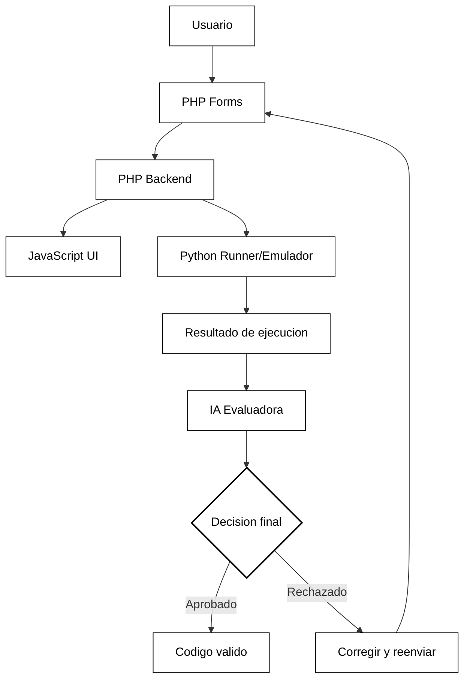

# Arquitectura del Proyecto (Presentacion)

Este proyecto usa una arquitectura mixta donde:

- `PHP` maneja la logica del backend.
- `PHP Forms` recibe y procesa entradas del usuario.
- `JavaScript` controla la interaccion del frontend.
- `Python` se conecta de forma directa para ejecutar/emular codigo y validar si corre correctamente.
- La `IA` revisa el resultado final y tiene la ultima palabra para aprobar o rechazar.

## Diagrama Global (Blanco y Negro)

Imagen exportada: `docs/diagrama_global_bn.jpeg`

## Flujo General

1. Usuario envia datos desde un formulario.
2. PHP procesa la solicitud.
3. JavaScript actualiza la interfaz.
4. Python ejecuta o emula el codigo.
5. IA evalua el resultado y decide.

## Objetivo

Tener una plataforma simple para ejecutar codigo, validarlo automaticamente y cerrar el proceso con una revision inteligente por IA.
